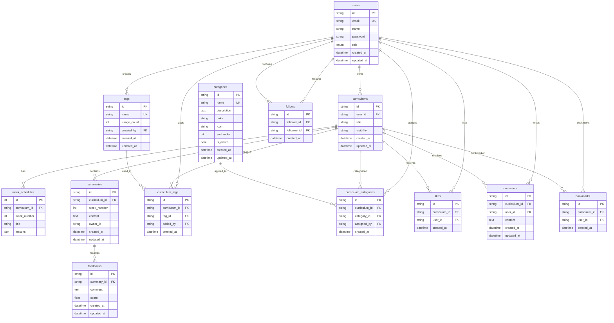

# LLearn 🚀

> **AI 기반 개인화 학습 커리큘럼 플랫폼**  
> 목표에 맞는 커리큘럼을 AI로 생성하고, 학습 요약에 대한 개인화된 피드백을 받아보세요!

[](https://python.org)
[](https://fastapi.tiangolo.com)
[](https://python-poetry.org/)
[](https://docker.com)
[](LICENSE)

# Demo


## 📋 목차

- [🎯 프로젝트 소개](#-프로젝트-소개)
- [✨ 주요 기능](#-주요-기능)
- [🏗️ 아키텍처](#️-아키텍처)
- [🚀 빠른 시작](#-빠른-시작)
- [📚 API 문서](#-api-문서)
- [🛠️ 기술 스택](#️-기술-스택)
- [🔒 보안](#-보안)
- [📊 모니터링](#-모니터링)
- [🤝 기여하기](#-기여하기)

## 🎯 프로젝트 소개

**LLearn**은 AI를 활용한 개인화 학습 플랫폼입니다. 학습자의 목표와 수준에 맞는 커리큘럼을 자동으로 생성하고, 학습 진행 상황에 따라 맞춤형 피드백을 제공합니다.

### 핵심 가치

- 🎯 **목표 기반 학습**: 개인의 학습 목표에 맞는 체계적인 커리큘럼
- 🤖 **AI 피드백**: 학습 요약에 대한 5단계 평가 (정확성, 누락, 오류, 심화질문, 확장학습)
- 📈 **진도 추적**: 학습 현황과 성취도를 한눈에 확인
- 👥 **커뮤니티**: 다른 학습자들과 경험 공유 및 동기 부여

## ✨ 주요 기능

### 🎓 학습 관리
- **AI 커리큘럼 생성**: 목표, 기간, 난이도를 입력하면 자동으로 주차별 커리큘럼 생성
- **주차별 학습 요약**: 학습 내용을 요약하고 기록
- **개인화 피드백**: AI가 요약 내용을 분석해 5가지 관점에서 피드백 제공
- **학습 통계**: 진도율, 연속 학습 일수, 점수 분포 등 상세 통계

### 🌐 소셜 기능
- **피드 공유**: 공개 커리큘럼을 피드에서 발견
- **좋아요 & 댓글**: 관심 있는 커리큘럼에 반응
- **팔로우 시스템**: 다른 학습자를 팔로우하고 학습 현황 확인
- **북마크**: 나중에 참고할 커리큘럼 저장

### 🏷️ 분류 & 검색
- **태그 시스템**: 커리큘럼에 태그를 추가해 분류
- **카테고리**: 관리자가 생성한 카테고리로 체계적 분류
- **검색 기능**: 태그, 카테고리, 키워드로 원하는 커리큘럼 발견

### 👨‍💼 관리자 기능
- **사용자 관리**: 사용자 역할 변경, 계정 관리
- **콘텐츠 관리**: 커리큘럼 공개/비공개 설정, 삭제
- **피드 관리**: 전체 피드 캐시 갱신, 콘텐츠 모더레이션

## Sequence Diagram

<details>
  <summary> 1. 회원가입 & 로그인 </summary>

  ```mermaid
  sequenceDiagram
    participant U as User
    participant F as Frontend
    participant A as API Server
    participant D as Database
    
    Note over U,D: 회원가입 플로우
    U->>F: 회원가입 정보 입력
    F->>A: POST /auth/signup
    Note right of A: 유효성 검증<br/>- 이메일 형식<br/>- 비밀번호 규칙<br/>- 이름 중복 체크
    A->>D: 이메일/이름 중복 확인
    D-->>A: 중복 여부 반환
    alt 중복 존재
        A-->>F: 400 Bad Request (중복 오류)
        F-->>U: 오류 메시지 표시
    else 중복 없음
        A->>A: 비밀번호 해시화
        A->>D: 사용자 정보 저장
        D-->>A: 저장 완료 (user_id 반환)
        A-->>F: 201 Created (회원가입 성공)
        F-->>U: 가입 완료 메시지
    end
    
    Note over U,D: 로그인 플로우
    U->>F: 이메일/비밀번호 입력
    F->>A: POST /auth/login (form-data)
    A->>D: 이메일로 사용자 조회
    D-->>A: 사용자 정보 반환
    alt 사용자 없음
        A-->>F: 401 Unauthorized
        F-->>U: "이메일이 존재하지 않습니다"
    else 사용자 존재
        A->>A: 비밀번호 검증
        alt 비밀번호 불일치
            A-->>F: 401 Unauthorized
            F-->>U: "비밀번호가 일치하지 않습니다"
        else 비밀번호 일치
            A->>A: JWT 토큰 생성
            A-->>F: 200 OK (access_token, role)
            F->>F: 토큰을 로컬 스토리지에 저장
            F-->>U: 로그인 성공, 메인 페이지 이동
        end
    end
```    
</details>

<details>
  <summary> 2. AI 커리큘럼 생성 </summary>

  ```mermaid
  sequenceDiagram
    participant U as User
    participant F as Frontend
    participant A as API Server
    participant L as LLM Service
    participant D as Database
    
    Note over U,D: AI 커리큘럼 생성 플로우
    U->>F: 커리큘럼 생성 폼 작성
    Note right of U: - 학습 목표<br/>- 기간 (1-24주)<br/>- 난이도 (beginner/intermediate/expert)<br/>- 추가 세부사항
    
    F->>A: POST /curriculums/generate
    Note right of A: Authorization 헤더 검증
    A->>A: JWT 토큰에서 user_id 추출
    A->>A: 사용자 커리큘럼 개수 확인 (최대 10개)
    
    alt 커리큘럼 개수 초과
        A-->>F: 403 Forbidden (최대 10개 제한)
        F-->>U: "최대 10개까지만 생성 가능합니다"
    else 생성 가능
        A->>A: 요청 데이터 유효성 검증
        A->>L: LLM 커리큘럼 생성 요청
        Note right of L: 프롬프트 템플릿:<br/>- 목표: {goal}<br/>- 기간: {period}주<br/>- 난이도: {difficulty}<br/>- 세부사항: {details}
        
        L->>L: GPT-4o-mini로 커리큘럼 생성
        Note right of L: 응답 형식:<br/>- title: 커리큘럼 제목<br/>- week_schedules: 주차별 스케줄<br/>  - week_number<br/>  - title<br/>  - lessons (1-5개)
        
        alt LLM 생성 실패
            L-->>A: 500 Internal Error
            A-->>F: 500 Server Error
            F-->>U: "AI 생성에 실패했습니다. 다시 시도해주세요"
        else LLM 생성 성공
            L-->>A: 구조화된 커리큘럼 데이터
            A->>A: 응답 데이터 검증 및 파싱
            A->>D: 커리큘럼 저장
            Note right of D: curriculums 테이블<br/>+ week_schedules 테이블
            D-->>A: 저장 완료 (curriculum_id)
            A-->>F: 201 Created (생성된 커리큘럼)
            F-->>U: 생성 완료, 커리큘럼 상세 페이지 이동
        end
    end
```    
</details>

<details>
  <summary> 3. 학습 요약 작성 및 AI 피드백 </summary>

  ```mermaid
  sequenceDiagram
    participant U as User
    participant F as Frontend
    participant A as API Server
    participant D as Database
    participant L as LLM Service
    
    Note over U,L: 학습 요약 작성 플로우
    U->>F: 특정 주차 학습 완료 후 요약 작성
    Note right of U: 100-5000자 학습 요약
    F->>A: POST /curriculums/{id}/weeks/{week}/summaries
    A->>A: 권한 확인 (커리큘럼 소유자인지)
    A->>D: 해당 주차가 존재하는지 확인
    D-->>A: 주차 정보 반환
    
    alt 주차 없음 또는 권한 없음
        A-->>F: 404 Not Found / 403 Forbidden
        F-->>U: 오류 메시지 표시
    else 유효한 요청
        A->>D: 요약 저장
        D-->>A: 저장 완료 (summary_id)
        A-->>F: 201 Created (요약 생성 완료)
        F-->>U: 요약 저장 완료, AI 피드백 생성 버튼 활성화
    end
    
    Note over U,L: AI 피드백 생성 플로우
    U->>F: AI 피드백 생성 요청
    F->>A: POST /summaries/{summary_id}/feedbacks/generate
    A->>A: 권한 확인 (요약 작성자인지)
    A->>D: 기존 피드백 존재 여부 확인
    D-->>A: 피드백 존재 여부
    
    alt 이미 피드백 존재
        A-->>F: 400 Bad Request (이미 피드백 존재)
        F-->>U: "이미 피드백이 생성되었습니다"
    else 피드백 없음
        A->>D: 커리큘럼 주차별 레슨 데이터 조회
        D-->>A: 해당 주차 레슨 목록
        A->>D: 사용자 요약 내용 조회
        D-->>A: 요약 내용
        
        A->>L: AI 피드백 생성 요청
        Note right of L: 5단계 평가 프롬프트:<br/>1. 정확성 (내용이 정확한가?)<br/>2. 누락 (빠진 중요 내용은?)<br/>3. 오류 (잘못 이해한 부분은?)<br/>4. 심화질문 (더 깊이 생각할 점은?)<br/>5. 확장학습 (추가로 학습할 내용은?)<br/>+ 0.0-10.0 점수
        
        L->>L: GPT-4o-mini로 피드백 생성
        alt LLM 생성 실패
            L-->>A: 500 Internal Error
            A-->>F: 500 Server Error
            F-->>U: "AI 피드백 생성에 실패했습니다"
        else LLM 생성 성공
            L-->>A: 구조화된 피드백 (comment + score)
            A->>A: 점수 기반 등급 계산 (A+, A, B+, B, C+, C, D)
            A->>D: 피드백 저장
            D-->>A: 저장 완료 (feedback_id)
            A-->>F: 201 Created (피드백 생성 완료)
            F-->>U: 피드백 표시 (점수, 등급, 상세 코멘트)
        end
    end
```    
</details>

<details>
  <summary> 4. 소셜 기능 (좋아요/댓글/북마크) </summary>

  ```mermaid
  sequenceDiagram
    participant U as User
    participant F as Frontend
    participant A as API Server
    participant D as Database
    participant R as Redis Cache
    
    Note over U,R: 좋아요 기능
    U->>F: 커리큘럼 좋아요 클릭
    F->>A: POST /curriculums/{id}/like
    A->>A: JWT에서 user_id 추출
    A->>D: 커리큘럼 접근 가능 여부 확인
    D-->>A: 커리큘럼 정보 반환
    
    A->>D: 이미 좋아요 했는지 확인
    D-->>A: 좋아요 존재 여부
    
    alt 이미 좋아요함
        A-->>F: 409 Conflict (중복 좋아요)
        F-->>U: "이미 좋아요를 눌렀습니다"
    else 좋아요 안함
        A->>D: 좋아요 레코드 생성
        D-->>A: 생성 완료
        A->>R: 좋아요 카운트 캐시 무효화
        Note right of R: 키: like_count:{curriculum_id}
        A-->>F: 201 Created (좋아요 성공)
        F->>F: UI 업데이트 (하트 아이콘 활성화)
        F-->>U: 좋아요 완료
    end
    
    Note over U,R: 좋아요 취소
    U->>F: 좋아요 취소 클릭
    F->>A: DELETE /curriculums/{id}/like
    A->>D: 좋아요 레코드 삭제
    D-->>A: 삭제 완료
    A->>R: 좋아요 카운트 캐시 무효화
    A-->>F: 204 No Content
    F-->>U: 좋아요 취소 완료
    
    Note over U,R: 댓글 작성
    U->>F: 댓글 내용 입력 (1-1000자)
    F->>A: POST /curriculums/{id}/comments
    A->>A: 내용 유효성 검증
    A->>D: 커리큘럼 접근 권한 확인
    D-->>A: 권한 확인 완료
    
    A->>D: 댓글 저장
    D-->>A: 저장 완료 (comment_id)
    A-->>F: 201 Created (댓글 생성)
    F-->>U: 댓글 목록에 추가 표시
    
    Note over U,R: 댓글 수정
    U->>F: 내 댓글 수정
    F->>A: PUT /curriculums/comments/{comment_id}
    A->>D: 댓글 작성자 확인
    D-->>A: 작성자 정보
    
    alt 작성자 아님
        A-->>F: 403 Forbidden
        F-->>U: "본인 댓글만 수정 가능합니다"
    else 작성자임
        A->>D: 댓글 내용 업데이트
        D-->>A: 업데이트 완료
        A-->>F: 200 OK (수정 완료)
        F-->>U: 댓글 내용 업데이트
    end
    
    Note over U,R: 북마크 기능
    U->>F: 북마크 추가
    F->>A: POST /curriculums/{id}/bookmark
    A->>D: 중복 북마크 확인
    D-->>A: 북마크 존재 여부
    
    alt 이미 북마크함
        A-->>F: 409 Conflict
        F-->>U: "이미 북마크되었습니다"
    else 북마크 안함
        A->>D: 북마크 레코드 생성
        D-->>A: 생성 완료
        A-->>F: 201 Created
        F-->>U: 북마크 완료
    end
```    
</details>

<details>
  <summary> 5. 피드 조회 및 캐시 </summary>

  ```mermaid
  sequenceDiagram
    participant U as User
    participant F as Frontend
    participant A as API Server
    participant R as Redis Cache
    participant D as Database
    
    Note over U,D: 공개 피드 조회 (캐시 우선)
    U->>F: 피드 페이지 접속
    F->>A: GET /feed/public?page=1&items_per_page=20
    A->>A: JWT 토큰 검증
    A->>R: 캐시된 피드 데이터 확인
    Note right of R: 캐시 키: feed:public_curriculums:page:{page}:size:{size}<br/>TTL: 5분 (300초)
    
    alt 캐시 HIT
        R-->>A: 캐시된 피드 데이터 반환
        A-->>F: 200 OK (캐시된 데이터)
        F-->>U: 빠른 피드 표시
    else 캐시 MISS
        A->>D: 공개 커리큘럼 목록 조회
        Note right of D: SELECT * FROM curriculums<br/>WHERE visibility = 'PUBLIC'<br/>ORDER BY updated_at DESC<br/>LIMIT {size} OFFSET {offset}
        D-->>A: 커리큘럼 목록
        
        A->>D: 각 커리큘럼의 소유자 정보 조회
        D-->>A: 소유자 이름들
        
        A->>D: 각 커리큘럼의 카테고리/태그 정보 조회
        D-->>A: 카테고리/태그 데이터
        
        A->>A: 피드 아이템 데이터 구성
        Note right of A: - 커리큘럼 기본 정보<br/>- 소유자 이름<br/>- 총 주차/레슨 수<br/>- 카테고리 이름/색상<br/>- 태그 목록<br/>- 상대 시간 ("2시간 전")
        
        A->>R: 구성된 피드 데이터 캐시 저장
        Note right of R: TTL 5분, 무작위 지연(±30초) 추가로<br/>캐시 스탬피드 방지
        A-->>F: 200 OK (새로 구성된 데이터)
        F-->>U: 피드 표시
    end
    
    Note over U,D: 필터링된 피드 조회
    U->>F: 카테고리/태그 필터 적용
    F->>A: GET /feed/public?category_id={id}&tags=Python,AI
    A->>R: 필터별 캐시 확인
    Note right of R: 필터별 별도 캐시 키:<br/>feed:public:category:{id}:tags:{tags}
    
    alt 필터 캐시 HIT
        R-->>A: 필터된 캐시 데이터
        A-->>F: 200 OK
        F-->>U: 필터된 피드 표시
    else 필터 캐시 MISS
        A->>D: 필터 조건으로 커리큘럼 조회
        Note right of D: 카테고리/태그 JOIN으로<br/>조건에 맞는 커리큘럼 검색
        D-->>A: 필터된 커리큘럼 목록
        A->>A: 피드 아이템 구성
        A->>R: 필터별 캐시 저장
        A-->>F: 200 OK
        F-->>U: 필터된 피드 표시
    end
    
    Note over U,D: 캐시 무효화 (커리큘럼 수정 시)
    U->>F: 커리큘럼 수정/삭제
    F->>A: PATCH/DELETE /curriculums/{id}
    A->>D: 커리큘럼 수정/삭제
    D-->>A: 작업 완료
    
    A->>R: 관련 피드 캐시 무효화
    Note right of R: 무효화 대상:<br/>- feed:public_curriculums:*<br/>- feed:public:category:*<br/>- feed:public:tags:*
    A->>R: 특정 커리큘럼 피드 갱신 트리거
    A-->>F: 200 OK / 204 No Content
    F-->>U: 작업 완료
    
    Note over U,D: 관리자 전체 피드 캐시 갱신
    participant Admin as Admin
    Admin->>F: 전체 피드 캐시 갱신 요청
    F->>A: POST /feed/refresh (Admin 권한 필요)
    A->>A: 관리자 권한 확인
    A->>R: 모든 피드 관련 캐시 삭제
    A->>D: 최신 100개 커리큘럼 조회
    D-->>A: 커리큘럼 데이터
    A->>A: 피드 데이터 pre-warming
    A->>R: 새로운 캐시 데이터 저장
    A-->>F: 204 No Content
    F-->>Admin: 캐시 갱신 완료
```    
</details>

<details>
  <summary> 6. 태그 및 카테고리 관리 </summary>

  ```mermaid
  sequenceDiagram
    participant U as User
    participant F as Frontend
    participant A as API Server
    participant D as Database
    participant Admin as Admin User
    
    Note over U,D: 커리큘럼에 태그 추가
    U->>F: 커리큘럼 상세 페이지에서 태그 추가
    Note right of U: 최대 10개 태그 입력<br/>예: ["Python", "백엔드", "초급"]
    F->>A: POST /curriculums/{id}/tags
    A->>A: 권한 확인 (커리큘럼 소유자인지)
    A->>D: 현재 커리큘럼의 태그 수 확인
    D-->>A: 현재 태그 개수
    
    alt 태그 개수 초과 (10개 이상)
        A-->>F: 400 Bad Request (태그 개수 제한)
        F-->>U: "최대 10개까지만 추가 가능합니다"
    else 태그 추가 가능
        loop 각 태그에 대해
            A->>D: 태그 존재 여부 확인
            D-->>A: 태그 존재 여부
            
            alt 태그 없음
                A->>D: 새 태그 생성
                Note right of D: tags 테이블에 INSERT<br/>- name: 태그명 (소문자 변환)<br/>- created_by: user_id<br/>- usage_count: 0
                D-->>A: 새 태그 생성 완료
            else 태그 존재
                A->>A: 기존 태그 사용
            end
            
            A->>D: 커리큘럼-태그 연결 생성
            Note right of D: curriculum_tags 테이블에 INSERT<br/>중복 방지 (UNIQUE 제약)
            D-->>A: 연결 완료
            
            A->>D: 태그 사용 횟수 증가
            Note right of D: UPDATE tags SET usage_count = usage_count + 1
            D-->>A: 사용 횟수 업데이트 완료
        end
        
        A-->>F: 201 Created (태그 추가 완료)
        F-->>U: 태그 목록 업데이트 표시
    end
    
    Note over U,D: 태그 검색 (자동완성)
    U->>F: 태그 입력 필드에 타이핑
    F->>A: GET /tags/search?q={검색어}&limit=10
    A->>D: 태그 이름으로 LIKE 검색
    Note right of D: SELECT * FROM tags<br/>WHERE name LIKE '%{검색어}%'<br/>ORDER BY usage_count DESC<br/>LIMIT 10
    D-->>A: 매칭되는 태그 목록
    A-->>F: 200 OK (태그 제안 목록)
    F-->>U: 드롭다운으로 태그 제안 표시
    
    Note over Admin,D: 관리자 - 카테고리 생성
    Admin->>F: 관리자 페이지에서 카테고리 생성
    Note right of Admin: - 이름 (2-30자)<br/>- 설명<br/>- 색상 (#FFFFFF)<br/>- 아이콘<br/>- 정렬 순서
    F->>A: POST /categories (Admin 권한 필요)
    A->>A: 관리자 권한 확인
    A->>D: 카테고리 이름 중복 확인
    D-->>A: 중복 여부
    
    alt 이름 중복
        A-->>F: 409 Conflict (이름 중복)
        F-->>Admin: "동일한 이름의 카테고리가 존재합니다"
    else 중복 없음
        A->>A: 색상 형식 검증 (헥스 코드)
        A->>D: 카테고리 저장
        Note right of D: categories 테이블에 INSERT<br/>- is_active: true (기본값)<br/>- sort_order: 자동 할당
        D-->>A: 저장 완료 (category_id)
        A-->>F: 201 Created (카테고리 생성)
        F-->>Admin: 카테고리 목록에 추가 표시
    end
    
    Note over U,D: 커리큘럼에 카테고리 할당
    U->>F: 커리큘럼에 카테고리 선택
    F->>A: POST /curriculums/{id}/category
    A->>A: 권한 확인 (커리큘럼 소유자)
    A->>D: 카테고리 활성 상태 확인
    D-->>A: 카테고리 정보 (is_active)
    
    alt 비활성 카테고리
        A-->>F: 400 Bad Request (비활성 카테고리)
        F-->>U: "비활성화된 카테고리는 할당할 수 없습니다"
    else 활성 카테고리
        A->>D: 기존 카테고리 할당 해제 (1:1 관계)
        A->>D: 새 카테고리 할당
        Note right of D: curriculum_categories 테이블<br/>UNIQUE(curriculum_id) 제약으로<br/>1:1 관계 보장
        D-->>A: 할당 완료
        A->>D: 카테고리 사용 횟수 증가
        A-->>F: 201 Created (카테고리 할당)
        F-->>U: 카테고리 표시 업데이트
    end
    
    Note over U,D: 태그로 커리큘럼 검색
    U->>F: 태그 기반 검색
    F->>A: GET /curriculums/search/by-tags?tag_names=Python,AI
    A->>D: 태그 교집합으로 커리큘럼 검색
    Note right of D: SELECT curriculum_id FROM curriculum_tags ct<br/>JOIN tags t ON ct.tag_id = t.id<br/>WHERE t.name IN ('python', 'ai')<br/>GROUP BY curriculum_id<br/>HAVING COUNT(*) = 2
    D-->>A: 매칭되는 커리큘럼 ID 목록
    A-->>F: 200 OK (커리큘럼 ID 목록)
    F->>A: 커리큘럼 상세 정보 조회 (별도 요청)
    A->>D: 커리큘럼 상세 정보
    D-->>A: 커리큘럼 데이터
    A-->>F: 커리큘럼 정보
    F-->>U: 검색 결과 표시
```    
</details>

<details>
  <summary> 7. 학습 통계 및 진도 추적 </summary>

  ```mermaid
  sequenceDiagram
    participant U as User
    participant F as Frontend
    participant A as API Server
    participant D as Database
    
    Note over U,D: 학습 통계 대시보드 조회
    U->>F: 마이페이지 → 학습 통계 탭
    F->>A: GET /users/me/learning/stats?days=30
    A->>A: JWT에서 user_id 추출
    
    A->>D: 사용자의 모든 커리큘럼 조회
    Note right of D: SELECT * FROM curriculums<br/>WHERE user_id = {user_id}
    D-->>A: 사용자 커리큘럼 목록
    
    A->>D: 기간 내 작성한 요약 조회
    Note right of D: SELECT * FROM summaries<br/>WHERE owner_id = {user_id}<br/>AND created_at >= {30일 전}
    D-->>A: 요약 목록
    
    A->>D: 기간 내 받은 피드백 조회
    Note right of D: SELECT f.* FROM feedbacks f<br/>JOIN summaries s ON f.summary_id = s.id<br/>WHERE s.owner_id = {user_id}<br/>AND f.created_at >= {30일 전}
    D-->>A: 피드백 목록
    
    A->>A: 학습 통계 계산
    Note right of A: 계산 항목:<br/>- 총 요약/피드백 수<br/>- 활성/완료 커리큘럼 수<br/>- 평균 점수, 최고/최저 점수<br/>- 등급별 분포 (A+, A, B+, B, C+, C, D)<br/>- 연속 학습 일수<br/>- 주간 목표 달성률
    
    A->>A: 연속 학습 일수 계산
    Note right of A: 요약 작성 날짜를 기준으로<br/>연속으로 학습한 일수 계산<br/>current_streak vs longest_streak
    
    A->>A: 커리큘럼별 진도 계산
    Note right of A: 각 커리큘럼별로:<br/>- 전체 주차 수<br/>- 작성된 요약 수<br/>- 완료율 = (요약 수 / 주차 수) × 100
    
    A-->>F: 200 OK (종합 학습 통계)
    F-->>U: 대시보드 표시 (차트 + 지표)
    
    Note over U,D: 학습 현황 간단 요약
    U->>F: 메인 페이지 위젯
    F->>A: GET /users/me/learning/overview
    A->>D: 최근 7일 활동 조회
    D-->>A: 최근 활동 데이터
    A->>A: 간단 요약 계산
    Note right of A: - 이번 주 학습 일수<br/>- 최근 피드백 평균 점수<br/>- 진행 중인 커리큘럼 수<br/>- 다음 학습 예정 항목
    A-->>F: 200 OK (간단 요약)
    F-->>U: 위젯 형태로 표시
    
    Note over U,D: 커리큘럼별 상세 진도
    U->>F: 특정 커리큘럼 진도 확인
    F->>A: GET /users/me/learning/progress
    A->>D: 사용자 모든 커리큘럼과 진도 조회
    Note right of D: 복잡한 JOIN 쿼리:<br/>- curriculums (기본 정보)<br/>- week_schedules (총 주차)<br/>- summaries (작성된 요약)<br/>- feedbacks (받은 피드백)
    D-->>A: 커리큘럼별 상세 데이터
    
    A->>A: 각 커리큘럼별 진도 상세 계산
    Note right of A: 커리큘럼별로:<br/>- 제목, 총 주차 수<br/>- 완료된 주차 목록<br/>- 다음 학습할 주차<br/>- 전체 진도율<br/>- 최근 학습 날짜<br/>- 예상 완료 날짜
    
    A-->>F: 200 OK (커리큘럼별 진도)
    F-->>U: 진도바와 상세 정보 표시
    
    Note over U,D: 학습 연속성 정보
    U->>F: 학습 스트릭 확인
    F->>A: GET /users/me/learning/streak
    A->>D: 사용자의 모든 요약 작성 날짜 조회
    Note right of D: SELECT DATE(created_at) as learning_date<br/>FROM summaries<br/>WHERE owner_id = {user_id}<br/>GROUP BY DATE(created_at)<br/>ORDER BY learning_date DESC
    D-->>A: 학습한 날짜 목록
    
    A->>A: 연속성 계산 알고리즘
    Note right of A: 1. 오늘부터 역순으로 확인<br/>2. 연속된 날짜 카운트<br/>3. 최장 연속 기록도 계산<br/>4. 총 학습 일수 계산
    
    A-->>F: 200 OK (연속성 정보)
    Note right of F: - current_streak: 7일<br/>- longest_streak: 21일<br/>- total_learning_days: 45일<br/>- 학습 캘린더 히트맵 데이터
    F-->>U: 스트릭 정보와 캘린더 표시
    
    Note over U,D: 월별 학습 진도 트렌드
    U->>F: 월별 통계 차트 요청
    F->>A: GET /users/me/learning/stats?days=365
    A->>D: 1년간 월별 학습 데이터 조회
    Note right of D: 월별 집계 쿼리:<br/>SELECT<br/>  DATE_FORMAT(created_at, '%Y-%m') as month,<br/>  COUNT(*) as summary_count,<br/>  AVG(f.score) as avg_score<br/>FROM summaries s<br/>LEFT JOIN feedbacks f ON s.id = f.summary_id<br/>WHERE s.owner_id = {user_id}<br/>GROUP BY month<br/>ORDER BY month
    D-->>A: 월별 집계 데이터
    
    A->>A: 트렌드 분석
    Note right of A: - 월별 학습량 변화<br/>- 평균 점수 변화<br/>- 학습 패턴 분석<br/>- 목표 달성률 계산
    
    A-->>F: 200 OK (월별 트렌드)
    F-->>U: 라인 차트로 트렌드 표시
```    
</details>

<details>
  <summary> 8. 팔로우 시스템 </summary>

  ```mermaid
  sequenceDiagram
    participant U as User
    participant F as Frontend
    participant A as API Server
    participant D as Database
    participant O as Other User
    
    Note over U,D: 사용자 팔로우
    U->>F: 다른 사용자 프로필에서 팔로우 버튼 클릭
    F->>A: POST /social/follow
    Note right of F: Request Body:<br/>{"followee_id": "01HJWXZ..."}
    A->>A: JWT에서 follower_id (현재 사용자) 추출
    A->>A: 자기 자신 팔로우 방지 체크
    
    alt 자기 자신 팔로우 시도
        A-->>F: 400 Bad Request
        F-->>U: "자기 자신은 팔로우할 수 없습니다"
    else 다른 사용자 팔로우
        A->>D: 팔로우 대상 사용자 존재 확인
        D-->>A: 사용자 존재 여부
        
        alt 사용자 없음
            A-->>F: 404 Not Found
            F-->>U: "존재하지 않는 사용자입니다"
        else 사용자 존재
            A->>D: 이미 팔로우 중인지 확인
            Note right of D: SELECT * FROM follows<br/>WHERE follower_id = {현재사용자}<br/>AND followee_id = {대상사용자}
            D-->>A: 팔로우 관계 존재 여부
            
            alt 이미 팔로우 중
                A-->>F: 409 Conflict
                F-->>U: "이미 팔로우 중입니다"
            else 팔로우 안함
                A->>D: 팔로우 관계 생성
                Note right of D: INSERT INTO follows<br/>(follower_id, followee_id, created_at)
                D-->>A: 팔로우 완료
                A-->>F: 201 Created
                F->>F: 팔로우 버튼 → 언팔로우 버튼으로 변경
                F-->>U: 팔로우 완료
            end
        end
    end
    
    Note over U,D: 언팔로우
    U->>F: 언팔로우 버튼 클릭
    F->>A: DELETE /social/unfollow
    Note right of F: Request Body:<br/>{"followee_id": "01HJWXZ..."}
    A->>D: 팔로우 관계 삭제
    Note right of D: DELETE FROM follows<br/>WHERE follower_id = {현재사용자}<br/>AND followee_id = {대상사용자}
    D-->>A: 삭제 완료 (영향받은 행 수)
    
    alt 팔로우 관계 없음
        A-->>F: 404 Not Found
        F-->>U: "팔로우하지 않은 사용자입니다"
    else 언팔로우 성공
        A-->>F: 204 No Content
        F->>F: 언팔로우 버튼 → 팔로우 버튼으로 변경
        F-->>U: 언팔로우 완료
    end
    
    Note over U,D: 팔로워 목록 조회
    U->>F: 특정 사용자의 팔로워 목록 확인
    F->>A: GET /social/users/{user_id}/followers?page=1
    A->>D: 팔로워 목록과 상호 팔로우 상태 조회
    Note right of D: 복잡한 JOIN 쿼리:<br/>SELECT u.*, <br/>  EXISTS(팔로우 여부) as is_following,<br/>  EXISTS(맞팔 여부) as is_followed_by<br/>FROM follows f<br/>JOIN users u ON f.follower_id = u.id<br/>WHERE f.followee_id = {대상사용자}
    D-->>A: 팔로워 목록 + 상호 관계 정보
    A-->>F: 200 OK (팔로워 목록)
    F-->>U: 팔로워 리스트 표시 (팔로우 상태 포함)
    
    Note over U,D: 팔로잉 목록 조회
    U->>F: 내가 팔로우하는 사용자 목록
    F->>A: GET /social/me/following?page=1
    A->>D: 팔로잉 목록과 상호 팔로우 상태 조회
    Note right of D: SELECT u.*,<br/>  true as is_following,<br/>  EXISTS(맞팔 여부) as is_followed_by<br/>FROM follows f<br/>JOIN users u ON f.followee_id = u.id<br/>WHERE f.follower_id = {현재사용자}
    D-->>A: 팔로잉 목록 + 맞팔 정보
    A-->>F: 200 OK (팔로잉 목록)
    F-->>U: 팔로잉 리스트 표시
    
    Note over U,D: 팔로우 통계 조회
    U->>F: 사용자 프로필 페이지
    F->>A: GET /social/users/{user_id}/stats
    A->>D: 팔로워/팔로잉 수 조회
    Note right of D: 두 개의 COUNT 쿼리:<br/>1. SELECT COUNT(*) FROM follows<br/>   WHERE followee_id = {user_id}<br/>2. SELECT COUNT(*) FROM follows<br/>   WHERE follower_id = {user_id}
    D-->>A: 팔로워 수, 팔로잉 수
    
    A->>D: 현재 사용자와의 상호 팔로우 관계 확인 (선택)
    D-->>A: 상호 팔로우 정보
    A-->>F: 200 OK (통계 정보)
    F-->>U: "팔로워 150명, 팔로잉 75명" 표시
    
    Note over U,D: 팔로우 추천 시스템
    U->>F: 추천 사용자 페이지
    F->>A: GET /social/suggestions?limit=10
    A->>D: 2차 연결 기반 추천 알고리즘
    Note right of D: 복잡한 추천 쿼리:<br/>1. 내가 팔로우하는 사람들이 팔로우하는 사람<br/>2. 나와 같은 태그를 많이 사용하는 사람<br/>3. 최근 활발한 사용자<br/>4. 이미 팔로우한 사람 제외
    D-->>A: 추천 사용자 목록
    A-->>F: 200 OK (추천 목록)
    F-->>U: "회원님이 좋아할 만한 사용자" 섹션 표시
    
    Note over U,D: 팔로우한 사용자의 커리큘럼 피드
    U->>F: 팔로잉 피드 탭
    F->>A: GET /curriculums/following?page=1
    A->>D: 팔로우한 사용자들의 공개 커리큘럼 조회
    Note right of D: SELECT c.* FROM curriculums c<br/>JOIN follows f ON c.user_id = f.followee_id<br/>WHERE f.follower_id = {현재사용자}<br/>AND c.visibility = 'PUBLIC'<br/>ORDER BY c.updated_at DESC
    D-->>A: 팔로잉 사용자들의 커리큘럼
    A-->>F: 200 OK (팔로잉 피드)
    F-->>U: 팔로우한 사용자들의 최신 커리큘럼 표시
```    
</details>

<details>
  <summary> 9. 관리자 기능 </summary>

  ```mermaid
  sequenceDiagram
    participant Admin as Admin User
    participant F as Frontend
    participant A as API Server
    participant D as Database
    participant R as Redis Cache
    
    Note over Admin,R: 관리자 사용자 관리
    Admin->>F: 관리자 페이지 → 사용자 관리
    F->>A: GET /admin/users?page=1&items_per_page=20
    A->>A: JWT 토큰에서 사용자 역할 확인
    
    alt 관리자 권한 없음
        A-->>F: 403 Forbidden
        F-->>Admin: "관리자 권한이 필요합니다"
    else 관리자 권한 있음
        A->>D: 사용자 목록 조회 (페이지네이션)
        Note right of D: SELECT id, email, name, role<br/>FROM users<br/>ORDER BY created_at DESC<br/>LIMIT {size} OFFSET {offset}
        D-->>A: 사용자 목록 + 총 개수
        A-->>F: 200 OK (사용자 목록)
        F-->>Admin: 사용자 관리 테이블 표시
    end
    
    Note over Admin,R: 사용자 역할 변경
    Admin->>F: 특정 사용자의 역할 변경 (USER → ADMIN)
    F->>A: PATCH /admin/users/{user_id}/role
    Note right of F: Request Body:<br/>{"role": "ADMIN"}
    A->>A: 관리자 권한 재확인
    A->>D: 대상 사용자 존재 확인
    D-->>A: 사용자 정보
    
    alt 사용자 없음
        A-->>F: 404 Not Found
        F-->>Admin: "존재하지 않는 사용자입니다"
    else 사용자 존재
        A->>A: 역할 값 유효성 검증 (USER/ADMIN)
        A->>D: 사용자 역할 업데이트
        Note right of D: UPDATE users<br/>SET role = 'ADMIN', updated_at = NOW()<br/>WHERE id = {user_id}
        D-->>A: 업데이트 완료
        A-->>F: 200 OK (변경된 사용자 정보)
        F-->>Admin: 역할 변경 완료 표시
    end
    
    Note over Admin,R: 커리큘럼 관리
    Admin->>F: 커리큘럼 관리 페이지
    F->>A: GET /admin/curriculums?page=1
    A->>D: 모든 커리큘럼 조회 (소유자 정보 포함)
    Note right of D: SELECT c.*, u.name as owner_name<br/>FROM curriculums c<br/>JOIN users u ON c.user_id = u.id<br/>ORDER BY c.created_at DESC
    D-->>A: 커리큘럼 목록 + 소유자 정보
    A-->>F: 200 OK (커리큘럼 관리 목록)`
    F-->>Admin: 커리큘럼 관리 테이블 표시
    
    Note over Admin,R: 커리큘럼 공개/비공개 변경
    Admin->>F: 특정 커리큘럼 비공개 처리
    F->>A: PATCH /admin/curriculums/{curriculum_id}/visibility
    Note right of F: Request Body:<br/>{"visibility": "PRIVATE"}
    A->>D: 커리큘럼 존재 확인
    D-->>A: 커리큘럼 정보
    
    A->>D: 공개 설정 업데이트
    Note right of D: UPDATE curriculums<br/>SET visibility = 'PRIVATE'<br/>WHERE id = {curriculum_id}
    D-->>A: 업데이트 완료
    
    A->>R: 관련 피드 캐시 무효화
    Note right of R: 공개 피드에서 제거되므로<br/>feed:public:* 캐시 삭제
    A-->>F: 200 OK (변경 완료)
    F-->>Admin: 공개 설정 변경 표시
    
    Note over Admin,R: 커리큘럼 강제 삭제
    Admin->>F: 부적절한 커리큘럼 삭제
    F->>A: DELETE /admin/curriculums/{curriculum_id}
    A->>D: 커리큘럼과 연관된 모든 데이터 삭제
    Note right of D: CASCADE DELETE로 연쇄 삭제:<br/>- week_schedules<br/>- summaries → feedbacks<br/>- likes, comments, bookmarks<br/>- curriculum_tags, curriculum_categories
    D-->>A: 삭제 완료
    
    A->>R: 관련 캐시 전체 무효화
    A-->>F: 204 No Content
    F-->>Admin: 삭제 완료 메시지
    
    Note over Admin,R: 전체 피드 캐시 강제 갱신
    Admin->>F: 시스템 관리 → 캐시 관리
    F->>A: POST /feed/refresh (관리자 전용)
    A->>A: 관리자 권한 확인
    A->>R: 모든 피드 관련 캐시 삭제
    Note right of R: 삭제 대상 캐시:<br/>- feed:public:*<br/>- feed:category:*<br/>- feed:tags:*<br/>- social_stats:*
    
    A->>D: 최신 공개 커리큘럼 100개 조회
    D-->>A: 최신 커리큘럼 데이터
    A->>A: 피드 데이터 재구성 (pre-warming)
    A->>R: 새로운 캐시 데이터 저장
    A-->>F: 204 No Content
    F-->>Admin: "피드 캐시가 갱신되었습니다"
    
    Note over Admin,R: 태그/카테고리 관리
    Admin->>F: 태그 관리 페이지
    F->>A: GET /tags/statistics
    A->>D: 태그 통계 조회
    Note right of D: SELECT<br/>  COUNT(*) as total_tags,<br/>  COUNT(CASE WHEN usage_count >= 10 THEN 1 END) as popular_tags,<br/>  COUNT(CASE WHEN usage_count = 0 THEN 1 END) as unused_tags<br/>FROM tags
    D-->>A: 태그 통계 데이터
    A-->>F: 200 OK (태그 통계)
    F-->>Admin: 태그 통계 대시보드 표시
    
    Admin->>F: 미사용 태그 일괄 삭제
    F->>A: DELETE /tags/{tag_id} (여러 개 반복)
    A->>D: 태그 사용 횟수 확인
    D-->>A: usage_count
    
    alt 사용 중인 태그
        A-->>F: 409 Conflict
        F-->>Admin: "사용 중인 태그는 삭제할 수 없습니다"
    else 미사용 태그
        A->>D: 태그 삭제
        D-->>A: 삭제 완료
        A-->>F: 204 No Content
        F-->>Admin: 삭제 완료
    end
    
    Note over Admin,R: 시스템 모니터링
    Admin->>F: 시스템 상태 대시보드
    F->>A: GET /admin/system/health
    A->>D: 데이터베이스 연결 상태 확인
    D-->>A: DB 상태
    A->>R: Redis 연결 상태 확인
    R-->>A: Redis 상태
    A->>A: 시스템 리소스 확인
    Note right of A: - API 응답 시간<br/>- 활성 사용자 수<br/>- LLM 사용량<br/>- 에러율
    A-->>F: 200 OK (시스템 상태)
    F-->>Admin: 상태 대시보드 표시
    
    Note over Admin,R: 사용자 활동 로그 조회
    Admin->>F: 사용자 활동 분석
    F->>A: GET /admin/users/{user_id}/activities
    A->>D: 사용자 활동 로그 조회
    Note right of D: 다양한 테이블에서 활동 기록:<br/>- 커리큘럼 생성/수정<br/>- 요약 작성<br/>- 소셜 활동 (좋아요/댓글)<br/>- 로그인 기록
    D-->>A: 활동 로그 데이터
    A-->>F: 200 OK (활동 기록)
    F-->>Admin: 타임라인 형태로 활동 표시
```    
</details>

---


## 🏗️ 아키텍처

```
┌─────────────────────────────────────────────────────────┐
│                 Frontend (React)                        │
└─────────────────────┬───────────────────────────────────┘
                      │ HTTP/REST API
┌─────────────────────▼───────────────────────────────────┐
│                   FastAPI Server                        │
│ ┌─────────────┐ ┌─────────────┐ ┌─────────────────────┐ │
│ │   Auth      │ │ Curriculum  │ │   Social & Feed     │ │
│ │   Users     │ │ Learning    │ │   Taxonomy          │ │
│ └─────────────┘ └─────────────┘ └─────────────────────┘ │
└─────────────────────┬───────────────────────────────────┘
                      │
┌─────────────────────▼───────────────────────────────────┐
│              Infrastructure Layer                       │
│ ┌───────────┐ ┌───────────┐ ┌─────────┐ ┌─────────────┐ │
│ │  MySQL    │ │   Redis   │ │ OpenAI  │ │  Langfuse   │ │
│ │  (Main    │ │  (Cache   │ │ (LLM    │ │ (Observ-    │ │
│ │   DB)     │ │  & Queue) │ │ Service)│ │  ability)   │ │
│ └───────────┘ └───────────┘ └─────────┘ └─────────────┘ │
└─────────────────────────────────────────────────────────┘
```

### Clean Architecture 구조

```
backend/app/
├── api/v1/                    # API 라우터
├── core/                      # 설정, 인증, DI
├── common/                    # 공통 서비스 (LLM, Cache, DB)
├── modules/                   # 도메인별 모듈
│   ├── user/
│   ├── curriculum/
│   ├── learning/
│   ├── social/
│   ├── taxonomy/
│   ├── feed/
│   └── admin/
└── utils/                     # 유틸리티

각 모듈 구조:
module/
├── domain/                    # 엔티티, 도메인 서비스
├── application/               # 비즈니스 로직
├── infrastructure/           # DB, 외부 서비스
└── interface/                # API 컨트롤러
```

### ERD



## 🚀 빠른 시작

### 사전 요구사항

- **Python 3.13+** 
- **Poetry** (의존성 관리)
- **Docker & Docker Compose**
- **MySQL 8.0+**
- **Redis 7.0+**
- **OpenAI API 키** (또는 다른 LLM 서비스)
- **Langfuse 계정** (선택사항, 모니터링용)

### 1. 프로젝트 클론 및 환경 설정

```bash
# 저장소 클론
git clone https://github.com/f-lab-edu/LLearn.git
cd LLearn

# 환경 변수 설정
cp .env.example .env
```

### 2. 환경 변수 설정

`.env` 파일에서 🔥 표시된 필수 항목들을 수정하세요:

```env
# 🔥 필수 변경 항목들
SECRET_KEY=your-secret-key-here                    # 🔥 
LLM_API_KEY=your-openai-api-key                   # 🔥
LANGFUSE_SECRET_KEY=your-langfuse-secret-key      # 🔥
LANGFUSE_PUBLIC_KEY=your-langfuse-public-key      # 🔥
DATABASE_ROOT_PASSWORD=your-secure-db-password    # 🔥
REDIS_PASSWORD=your-secure-redis-password         # 🔥
```

**시크릿 키 생성**:
```bash
python -c "import secrets; print(secrets.token_urlsafe(32))"
```

### 3. Docker Compose로 실행

```bash
# 전체 서비스 실행 (백엔드 + 프론트엔드 + DB + Redis + 모니터링)
docker-compose up -d

# 로그 확인
docker-compose logs -f app

# 특정 서비스만 실행
docker-compose up -d db redis  # DB, Redis만
docker-compose up app          # 백엔드만
```

### 4. 개발 환경 설정 (로컬)

```bash
# Poetry 설치
curl -sSL https://install.python-poetry.org | python3 -

# 의존성 설치
cd backend
poetry install

# 가상환경 활성화
poetry shell

# 환경 변수 로드 후 서버 실행
cd ..
uvicorn backend.app.main:app --reload --host 0.0.0.0 --port 8000
```

### 5. 데이터베이스 마이그레이션

```bash
# 컨테이너 내에서 실행
docker-compose exec app poetry run alembic upgrade head

# 또는 로컬에서 실행
cd backend
poetry run alembic upgrade head
```

### 6. 접속 확인

- **백엔드 API**: http://localhost:8000
- **API 문서**: http://localhost:8000/docs
- **프론트엔드**: http://localhost:3000
- **Grafana**: http://localhost:3001 (admin/admin123)
- **Prometheus**: http://localhost:9090

## 📚 API 문서

### 주요 엔드포인트

#### 🔐 인증 (`/api/v1/auth`)
```http
POST /api/v1/auth/signup      # 회원가입
POST /api/v1/auth/login       # 로그인
GET  /api/v1/users/me         # 내 정보 조회
```

#### 📚 커리큘럼 (`/api/v1/curriculums`)
```http
POST /api/v1/curriculums                    # 커리큘럼 생성
POST /api/v1/curriculums/generate           # AI 커리큘럼 생성
GET  /api/v1/curriculums/me                 # 내 커리큘럼 목록
GET  /api/v1/curriculums/public             # 공개 커리큘럼 목록
GET  /api/v1/curriculums/{id}               # 커리큘럼 상세 조회
```

#### 📝 학습 & 피드백 (`/api/v1/summaries`, `/api/v1/feedbacks`)
```http
POST /api/v1/curriculums/{id}/weeks/{week}/summaries  # 학습 요약 작성
POST /api/v1/summaries/{id}/feedbacks/generate        # AI 피드백 생성
GET  /api/v1/users/me/learning/stats                  # 내 학습 통계
```

#### 👥 소셜 (`/api/v1/social`)
```http
POST /api/v1/curriculums/{id}/like          # 좋아요
POST /api/v1/curriculums/{id}/comments      # 댓글 작성
POST /api/v1/social/follow                  # 사용자 팔로우
GET  /api/v1/feed/public                    # 공개 피드 조회
```

### 상세 API 문서

프로젝트의 `docs/api/` 폴더에서 각 도메인별 상세 API 문서를 확인하실 수 있습니다:

- [📄 Auth & Users API](docs/api/user.md)
- [📚 Curriculum API](docs/api/curriculums.md) 
- [🎓 Learning & Feedback API](docs/api/learning.md)
- [👥 Social API](docs/api/social.md)
- [📰 Feed API](docs/api/feed.md)
- [🏷️ Taxonomy API](docs/api/taxonomy.md)
- [👨‍💼 Admin API](docs/api/admin.md)

## 🛠️ 기술 스택

### Backend Core
- **Framework**: FastAPI 0.116+ (고성능 비동기 웹 프레임워크)
- **Language**: Python 3.13
- **Dependency Management**: Poetry
- **Database**: MySQL 8.0 + SQLAlchemy (Async ORM)
- **Cache & Queue**: Redis 7.0+ 
- **Authentication**: JWT (python-jose)

### AI & LLM Integration
- **LLM Framework**: LangChain 0.3+ (추상화 레이어)
- **LLM Provider**: OpenAI GPT-4o-mini
- **Observability**: Langfuse (LLM 호출 추적 및 분석)
- **Prompt Management**: 구조화된 프롬프트 템플릿

### Architecture & DI
- **Pattern**: Clean Architecture (4-layer)
- **Dependency Injection**: dependency-injector
- **ID Generation**: ULID (Universally Unique Lexicographically Sortable Identifier)
- **Password Hashing**: bcrypt (passlib)

### DevOps & Monitoring
- **Containerization**: Docker + Docker Compose
- **Database Migration**: Alembic
- **Metrics**: Prometheus + Grafana
- **Health Checks**: 내장 헬스체크 엔드포인트
- **Logging**: 구조화된 로깅

### Development Tools
- **Code Formatting**: Black + Poetry scripts
- **Testing**: pytest + pytest-asyncio
- **Type Checking**: Pydantic 2.0+ (runtime validation)
- **API Documentation**: OpenAPI 3.0 (자동 생성)

### Frontend (Development)
- **Framework**: React (CRA 기반)
- **Development Server**: Hot-reload 지원
- **Container**: 개발용 Docker 환경

## 🔒 보안

### 인증 & 인가
```python
# JWT 기반 토큰 인증
from app.core.auth import get_current_user, Role

@router.get("/protected")
async def protected_endpoint(
    current_user: CurrentUser = Depends(get_current_user)
):
    return {"user_id": current_user.id, "role": current_user.role}

# 관리자 권한 체크
from app.core.auth import assert_admin

@router.get("/admin-only")
async def admin_only(
    current_user: CurrentUser = Depends(get_current_user)
):
    assert_admin(current_user)  # 403 if not admin
    return {"message": "Admin access granted"}
```

### 데이터 보호
- **비밀번호**: bcrypt 해싱 (Crypto 클래스)
- **SQL Injection**: SQLAlchemy ORM 사용으로 방지
- **입력 검증**: Pydantic 스키마로 런타임 검증
- **CORS**: 설정된 오리진만 허용

### 보안 설정 예시
```python
# CORS 설정
CORS_ORIGINS = [
    "http://localhost:3000",
    "http://127.0.0.1:3000"
]

# 시크릿 관리
SECRET_KEY = "your-secret-key"  # 환경변수로 관리
ALGORITHM = "HS256"
ACCESS_TOKEN_EXPIRE_MIN = 15
```

## 📊 모니터링

### Prometheus 메트릭
- **API 성능**: 응답 시간 분포 (P50/P95/P99)
- **에러율**: 4xx/5xx 상태코드 추적
- **처리량**: 초당 요청 수 (QPS)
- **LLM 사용량**: 호출 수, 토큰 사용량

### Grafana 대시보드
```yaml
# 주요 대시보드 패널
- API Response Time (P95)
- Error Rate by Endpoint  
- Database Connections
- Redis Cache Hit Rate
- LLM Cost Tracking
```

### 헬스체크
```python
# 엔드포인트: GET /health
{
    "status": "healthy",
    "service": "curriculum-api",
    "database": "connected",
    "redis": "connected",
    "llm_service": "available"
}
```

### Langfuse LLM 추적
```python
# 자동 추적되는 정보
- 프롬프트 템플릿 사용량
- 토큰 소비량 및 비용
- 응답 품질 분석
- 에러율 및 지연시간
```

## 🚀 배포

### Docker 멀티스테이지 빌드
```dockerfile
FROM python:3.13
WORKDIR /workspace

# Poetry 설치 및 의존성 관리
RUN pip install poetry
RUN poetry config virtualenvs.create false
COPY pyproject.toml poetry.lock ./
RUN poetry install --no-root

# 애플리케이션 복사
COPY . .
EXPOSE 8000
CMD ["sh", "/workspace/script/startup.sh"]
```

### 환경별 설정
```bash
# 개발 환경
docker-compose up -d

# 프로덕션 환경  
docker-compose -f docker-compose.prod.yml up -d
```

### CI/CD 권장사항
```yaml
# GitHub Actions 예시
name: CI/CD
on: [push, pull_request]
jobs:
  test:
    runs-on: ubuntu-latest
    steps:
      - uses: actions/checkout@v3
      - name: Run tests
        run: |
          docker-compose run app poetry run pytest
  
  deploy:
    if: github.ref == 'refs/heads/main'
    needs: test
    runs-on: ubuntu-latest
    steps:
      - name: Deploy to production
        run: |
          # 배포 스크립트 실행
```

## 🧪 테스트

### 테스트 실행
```bash
# Poetry를 통한 테스트
cd backend
poetry run pytest

# Docker를 통한 테스트
docker-compose run app poetry run pytest

# 커버리지 포함 테스트
poetry run pytest --cov=app tests/

# 특정 모듈 테스트
poetry run pytest tests/modules/curriculum/ -v
```

### 테스트 구조
```
backend/tests/
├── conftest.py              # 테스트 설정 및 픽스처
├── modules/
│   ├── user/               # 사용자 도메인 테스트
│   ├── curriculum/         # 커리큘럼 도메인 테스트
│   └── learning/          # 학습 도메인 테스트
├── integration/           # 통합 테스트
├── fixtures/             # 테스트 데이터
└── utils/               # 테스트 유틸리티
```

### 테스트 픽스처 예시
```python
# conftest.py
@pytest.fixture
async def test_db():
    """테스트용 DB 세션"""
    async with AsyncSessionLocal() as session:
        yield session

@pytest.fixture
def test_user():
    """테스트용 사용자 데이터"""
    return {
        "email": "test@example.com",
        "name": "테스트 사용자",
        "password": "Test1234!"
    }
```

## 🔧 개발 가이드

### 로컬 개발 환경
```bash
# 백엔드만 개발하는 경우
docker-compose up -d db redis  # DB, Redis만 실행
cd backend
poetry shell
uvicorn app.main:app --reload

# 프론트엔드 포함 개발
docker-compose up -d  # 전체 실행
```

### 코드 스타일
```bash
# Poetry scripts 사용
cd backend
poetry run black .          # 코드 포맷팅
poetry run pytest          # 테스트 실행

# Pre-commit hooks 설정 권장
pip install pre-commit
pre-commit install
```

### DB 마이그레이션
```bash
# 새 마이그레이션 생성
cd backend
poetry run alembic revision --autogenerate -m "Add new table"

# 마이그레이션 적용
poetry run alembic upgrade head

# 롤백
poetry run alembic downgrade -1
```

### 새 모듈 추가하기
```bash
# Clean Architecture 구조 따라서 생성
backend/app/modules/new_module/
├── domain/
│   ├── entity/
│   ├── repository/
│   └── service/
├── application/
│   └── service/
├── infrastructure/
│   └── repository/
├── interface/
│   └── controller/
└── core/
    └── di_container.py
```

## 🤝 기여하기

LLearn 프로젝트에 기여해주셔서 감사합니다! 

### 기여 방법

1. **Fork** 저장소를 포크합니다
2. **Branch** 새로운 기능 브랜치를 생성합니다
   ```bash
   git checkout -b feature/amazing-feature
   ```
3. **Commit** 변경사항을 커밋합니다
   ```bash
   git commit -m 'Add: amazing feature'
   ```
4. **Push** 브랜치에 푸시합니다
   ```bash
   git push origin feature/amazing-feature
   ```
5. **Pull Request**를 생성합니다

### 커밋 컨벤션
```
Type: Subject

Body (optional)

Footer (optional)
```

**Types**: `Add`, `Fix`, `Update`, `Remove`, `Refactor`, `Test`, `Docs`

### 개발 가이드라인
- Clean Architecture 패턴 준수
- 타입 힌트 사용 (Python 3.9+ 스타일)
- Pydantic 모델로 입출력 검증
- 단위 테스트 작성
- API 문서화 (docstring)

## 📄 라이선스

이 프로젝트는 [MIT 라이선스](LICENSE) 하에 배포됩니다.

## 🙏 감사의 말

- [FastAPI](https://fastapi.tiangolo.com/) - 빠르고 현대적인 웹 프레임워크
- [SQLAlchemy](https://www.sqlalchemy.org/) - 강력한 ORM
- [LangChain](https://langchain.com/) - LLM 애플리케이션 프레임워크
- [OpenAI](https://openai.com/) - AI 서비스 제공
- [Langfuse](https://langfuse.com/) - LLM 관측성 플랫폼

---

<div align="center">

**🌟 이 프로젝트가 도움이 되셨다면 별표를 눌러주세요!**

[](https://github.com/f-lab-edu/LLearn)

Made with ❤️ by [LLearn](https://github.com/f-lab-edu/LLearn)

</div>
